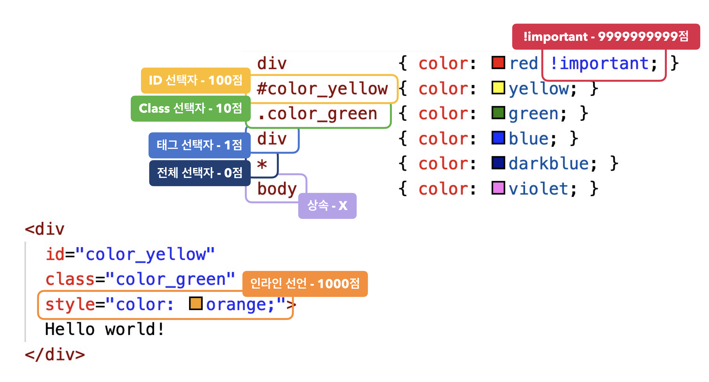

# Ch07. CSS 개요
- [1. 기본문법, 주석](#ch07-01-기본-문법-주석)
- [2. 선언방식](#ch07-02-선언-방식)
- [3. 선택자 - 기본](#ch07-03-선택자_기본)
- [4. 선택자 - 복함](#ch07-04-선택자_복합)
- [5. 선택자 - 가상클래스1](#ch07-05-선택자_가상-클래스1)
- [6. 선택자 - 가상클래스2](#ch07-06-선택자_가상-클래스2)
- [7. 선택자 - 가상요소](#ch07-07-선택자_가상-요소)
- [8. 선택자 - 속성](#ch07-08-선택자_속성)
- [9. 스타일 상속](#ch07-09-스타일-상속)
- [10. 선택자 우선순위](#ch07-10-선택자-우선-순위)


---------------------------------------------------------------------
# Ch07-01. 기본 문법, 주석
## 선택자 { 속성: 값; }
- 스타일(CSS)의 대상(Selector) { 종류(Property): 값(Value); }
- 태그 선택자, ...
## 실습 (Codepen.io)
```html
<span>HEROPY</span>
```
```css
span {
  font-size: 50px;
  color: blue;
  text-decoration: underline;
}
```


---------------------------------------------------------------------
# Ch07-02. 선언 방식
- 내장, 링크, 인라인, @import 방식
## 내장방식
- `<style></style>`의 내용으로 스타일을 작성하는 방식
```html
<style>
  div {
    color: red;
    margin: 20px;
  }
</style>
```
> 내장방식으로 직접 코드를 작성하는 것은, 좋은 방식은 아니다
## 인라인 방식
- 요소의 style 속성에 직접 스타일을 작성하는 방식(선택자 없음)
```html
<div style="color:red; magin: 20px;"></div>
```
## 링크 방식
- `<link />`로 외부 CSS 문서를 가져와서 연결하는 방식
```html
<link rel="stylesheet" href="./css/main.css" />
```
> `병력방식`: 한번에 가져옴
## @import 방식
- @import 규칙으로 `CSS 문서 안에서 또 다른 CSS 문서를 가져와 연결`하는 방식
```css
/* main.css */
@import url("./box.css");
div {
  color: red;
  margin: 20px;
}

/* box.css */
.box {
  background-color: red;
  padding: 20px;
}
```
> - `직렬 연결`: 연결이 지연된다(main.css가 연결이 끝나야 붙는다)
> - 많이 사용되는 방식은 아님
## 실습(hello)
- 위 @import 예제


---------------------------------------------------------------------
# Ch07-03. 선택자_기본
- `*`전체 선택자(Universal Selector): 모든 요소
- 태그 선택자(Type Selector): `tag` 태그 이름
- 클래스 선택자(Class Selector): `.value` class 속성의 값
- 아이디 선택자(ID Selector): `#value`


---------------------------------------------------------------------
# Ch07-04. 선택자_복합
## 일치 선택자(Basic Combinator)
- `ABCXYZ`
- 선택자 ABC와 XYZ를 동시에 만족하는 요소 선택
```css
span.orange {
  color: red;
}
```
> 태그 선택자를 앞에 적어야된다, 반대시 구분이 안되서 적용 X
## 자식 선택자(Child Combinator)
- `ABC > XYZ`
- 선택자 ABC의 자식 요소 XYZ 선택
```css
ul > .orange {
  color: red;
}
```
## 하위 선택자(Descendent Combinator)
- `ABC XYZ`
- 선택자 ABC의 하위 요소 XYZ 선택
```css
div .orange {
  color: red;
}
```
> 많이 사용
## 인접 형제 선택자(Adjacent Sibling Combinator)
- `ABC + XYZ`
- 선택자 ABC의 다음 형제 요소 XYZ 하나를 선택
```html
<ul>
  <li class="orange">오렌지</li>
  <li>망고</li>
</ul>
```
```css
.orange + li {
  color: red;
}
```
> 망고
## 일반 형제 선택자(General Sibling Combinator)
- `ABC ~ XYZ`
- 선택자 ABC의 다음 형제 XYZ 모두를 선택


---------------------------------------------------------------------
# Ch07-05. 선택자_가상 클래스(1)
- 가상 클래스 선택자(Pseudo-Classes)
## HOVER
- ABC:hover
- 선택자 ABC 요소에 마우스 커서가 올라가 있는 동안 선택
## ACTIVE
- ABC:active
- 마우스를 클릭하는 동안
```css
.box:active {
  width: 300px;
  background-color: royalblue;
}
```
## FOCUS
- ABC:focus
- ABC 요소가 포커스되면 선택
- 포커스가 되는 대표 요소: input, select, textarea
- input tabindex="-1"
```css
input:focus {
  background-color: orange;
}
```


## 실습(hello)
- hover
```css

.box {
  width: 100px;
  height: 100px;
  background-color: orange;
  transition: 1.2s;
}
.box:hover {
  width: 300px;
  background-color: royalblue;
}
```


---------------------------------------------------------------------
# Ch07-06. 선택자_가상 클래스(2)
## FIRST-CHILD
- ABC:first-child
- 선택자 ABC가 형제 요소 중 첫째라면 선택
## LAST-CHILD
- ABC:last-child, 막내
## NTH-CHILD
- ABC:nth-child(n), (n)째
- *:nth-child(2n): 0, 2, 4, 6, ... (n은 0부터 시작)
```css
.fruits *:nth-child(2) {
  color: red;
}
```
## NOT 부정 선택자(Negation)
- ABC:not(XYZ)
- 선택자 XYZ가 아닌 ABC 요소 선택


---------------------------------------------------------------------
# Ch07-07. 선택자_가상 요소
- 가상 요소 선택자(Pseudo-Elements)
## `BEFORE`
- ABC::before, 인라인(글자) 요소
- 선택자 ABC 요소의 내부 앞에 내용(Content)을 삽입, 자주 사용
```css
.box::before {
  content: "앞!";
}
```
## AFTER
- ABC::after, before와 같다

## 실습(hello)
```html
<!DOCTYPE html>
<html lang="en">
<head>
  <meta charset="UTF-8">
  <meta name="viewport" content="width=device-width, initial-scale=1.0">
  <title>Document</title>
  <link rel="stylesheet" href="./css/main.css">
  <!-- <link rel="stylesheet" href="./css/box.css"> -->
</head>
<body>
  <div class="box">HEROPY</div>
</body>
</html>
```
```css
.box {
  width: 100px;
  height: 100px;
  background-color: orange;
  /* transition: 1s; */
}
.box::after{
  content: "";
  display: block;
  width: 30px;
  height: 30px;
  background-color: royalblue;
}
```
> inline > block으로 바꿔주는 속성값: `display:block`


---------------------------------------------------------------------
# Ch07-08. 선택자_속성
## 속성 선택자
- [ABC]
```css
[disabled] {
  color: red;
}
[type="password"] {
  color: red;
}
[data-fruit-name="apple"] {
  color:red;
}
```
> - 일반적인 속성을 가지고는 유용하지 않다
> - `"` 생략가능하나 사용하는 것을 권장


---------------------------------------------------------------------
# Ch07-09. 스타일 상속
- 부모의 style이 하위요소에 상속된다
- 상속되는 CSS 속성들: 모두 글자/문자 관련 속성들!(But, 전부는 아님)
> font-style, font-weight, font-size, line-height, font-famility, color, text-align
## 강제 상속
- 실질적으로 상속이 되지 않는 CSS 속성을 강제로 상속시키는 것

## 실습(hello)
```html
<!DOCTYPE html>
<html lang="en">
<head>
  <meta charset="UTF-8">
  <meta name="viewport" content="width=device-width, initial-scale=1.0">
  <title>Document</title>
  <link rel="stylesheet" href="./css/main.css">
  <!-- <link rel="stylesheet" href="./css/box.css"> -->
</head>
<body>
  <div class="parent">
    <div class="child"></div>
  </div>
</body>
</html>
```
```css
.parent {
  width: 300px;
  height: 400px;
  background-color: orange;
}
.parent {
  width: 300px;
  height: 400px;
  background-color: orange;
}
.child {
  width: 100px;
  height: inherit;
  background-color: inherit;
  position: fixed;
  top: 100px;
  right: 10px;
}
```
> `height: inherit;`, background-color


---------------------------------------------------------------------
# Ch07-10. 선택자 우선 순위
우선순위란, 같은 요소가 여러 선언의 대상이 된 경우, 어떤 선언의 CSS 속성을 우선 적용할지 결정하는 방법
1. 점수가 높은 선언이 우선함
2. 점수가 같으면, 가장 마지막에 해석된 선언이 우선함
- 
## 정리
- important: 9,999,999,999
- inline: 1000
- id Selector: 100
- class: 10
- tag: 1
- *: 0
- 점수가 같으면, 선언순서
> 점수는 상속되지 않는다

- [!선택자점수_예제](./images/selectors_ex.png)
> - 가상 클래스 선택자 = 클래스 선택자 = 10
> - 요소선택자 = 태그선택자 = 1
> - 부정 선택자(not)은 점수 계산하지 않는다

## 실습
```html
<!DOCTYPE html>
<html lang="en">
<head>
  <meta charset="UTF-8">
  <meta name="viewport" content="width=device-width, initial-scale=1.0">
  <title>Document</title>
  <link rel="stylesheet" href="./css/main.css">
  <!-- <link rel="stylesheet" href="./css/box.css"> -->
</head>
<body>
  <div id="hello" class="hello" style="color:orange;">
    Hello World!
  </div>
</body>
</html>
```
```css
div {
  font-size: 70px;
}
div.hello {
  color: green;
}
.hello {
  color: red !important;
}
```
> id, important 는 잘 사용하지 않는다