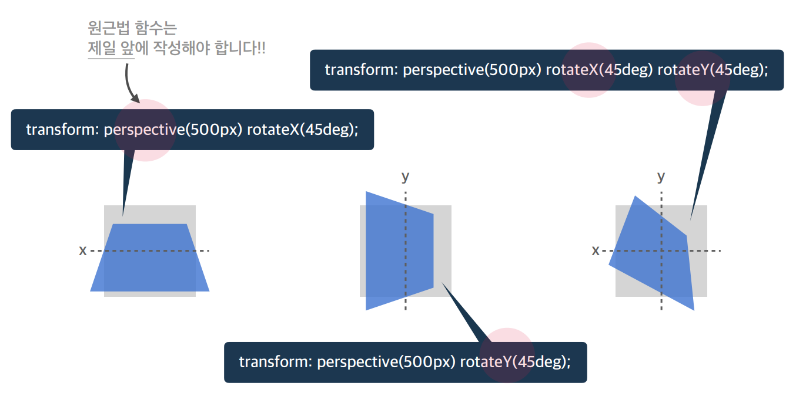

# Ch08. CSS 속성
- [1. 개요](#ch08-01-개요)
- [2. 너비 - width, height](#ch08-02-너비width-height)
- [3. css 단위](#ch08-03-css-단위)
- [4. 외부여백 - margin](#ch08-04-외부-여백margin)
- [5. 내부여백 - padding](#ch08-05-내부-여백padding)
- [6. 태두리 선(border)과 색상표현](#ch08-06-테두리-선border과-색상-표현)
- [7. 모서리 둥굴게 - border-radius](#ch08-07-모서리-둥굴게border-radius)
- [8. 크기계산 - box-sizing](#ch08-08-크기-계산box-sizing)
- [9. 넘침제어 - overflow](#ch08-09-넘침-제어overflow)
- [10. 출력특성 - display](#ch08-10-출력-특성display)
- [11. 투명도](#ch08-11-투명도)
- [12. 글꼴](#ch08-12-글꼴)
- [13. 문자](#ch08-13-문자)
- [14. 배경](#ch08-14-배경)
- [15. 배치(1)](#ch08-15-배치1)
- [16. 배치(2)](#ch08-16-배치2)
- [17. 배치(3)](#ch08-17-배치3)
- [18. 플랙스 정렬 Container - 1](#ch08-18-플랙스정렬-container1)
- [19. 플랙스 정렬 Container - 2](#ch08-19-플랙스정렬-container2)
- [20. 플랙스 정렬 - items](#ch08-20-플랙스정렬-items)
- [21. 전환](#ch08-21-전환)
- [22. 변환 - 1](#ch08-22-변환1)
- [23. 변환 - 2](#ch08-23-변환2)
- [24. Overwatch 캐릭터 선택예제- 1](#ch08-24-overwatch-캐릭터-선택예제1)
- [25. Overwatch 캐릭터 선택예제- 2](#ch08-25-overwatch-캐릭터-선택예제2)


---------------------------------------------------------------------
# ch08-01. 개요
- HTML 속성(Attributes), CSS 속성(Properties), JS 속성(Properties)
- 박스모델, 글꼴, 문자, 배경, 배치, `플렉스(정렬)`, `전환`, 변환, 띄움, 애니메이션, 그리드, 다단, 필터
- 플렉스: 수평정렬, 띄움의 최신 기술
- 전환: 애니메이션(전, 후) 상태
- 변환: 회전, 이동, 크기 조절(요소의 변화 2D, 3D)
- 띄움: 요소를 공중으로 띄운다(그 주변으로 문자가 흐를 수 있는 구조)
- 다단: 하나의 페이지를 여러 개로 나누는 것
- 필터: 흐림(Blur)/흑백(Grayscale)/반전(Reverse) 처리 등


---------------------------------------------------------------------
# ch08-02. 너비(width, height)
- 박스 모델
- 요소의 가로/세로너비
> - `auto`: 기본값, 브라우저가 너비를 계산
> - 단위: `px`, em, vw 등 단위로 저장
- span
> - 대표적인 인라인 요소
> - 포함한 크기만큼 자동으로 줄어듬(auto)
- `div`
> - 대표적인 블럭 요소
> - w: `부모 요소의 크기만큼 자동으로 늘어남(auto)`
> - h: 포함한 콘텐츠 크기만큼 자동으로 줄어듬
## max-width, max-height
- 요소가 커질 수 있는 최대 가로/세로 너비
> - none: 최대 너비 제한 없음(default)
> - auto, 단위
## min-width, max-height
> - 0: 최소 너비 제한 없음(default)
> - auto, 단위

## 실습(codepen)
```html
<div class="parent">
  <div class="child"></div>
</div>
```
```css
.parent {
  width: 300px;
  height: 200px;
  background-color: royalblue;
}
.child {
  min-width: 400px;
  height: 100px;
  background-color: orange; 
}
```
> 부모가 300px이지만 400px까지만 줄어듬


---------------------------------------------------------------------
# ch08-03. CSS 단위
- px: 픽셀(절대단위), 모니터크기(상대단위)
- %: 백분위
- em: 요소의 글꼴 크기, 1em(default = 10px)
- rem: 루트 요소(html)의 글꼴 크기
- vw: 뷰포트 가로 너비의 백분율
- vh: 뷰포트 세로 너비의 백뷴율

## 실습
```css
html {
/*   font-size: 16px; */
}
.parent {
  width: 300px;
  height: 200px;
  background-color: royalblue;
  font-size: 10px;
}
.child {
  width: 10em;
  height: 50%;
  background-color: orange; 
}
```


---------------------------------------------------------------------
# ch08-04. 외부 여백(margin)
- 요소 의 외부 여백(공간)을 지정하는 `단축 속성`
- 음수를 사용할 수 있다
> - 0: default
> - auto: 브라우저가 여백을 계산, 가운데 정렬의 활용
> - 단위
> - margin-top, right, bottom, left (`개별속성`)
> > - margin: 10px 20px; // top/bottom: 10px, left/right: 20px
> > - margin: 10px 20px 30px; //top, left/right, bottom
> > - marign: 10px 20px 30px 40px // top right, bottom, left(시계방향)
> > 요소의 크기는 늘어나지 않음

## 실습
```html
<div class="container">
  <div class="item"></div>
  <div class="item"></div>
  <div class="item"></div>
</div>
```
```css
.container {
  
}
.container .item {
  width: 100px;
  height: 100px;
  background-color: orange;
  border: 4px solid red;
  margin: -20px 10px;
}
```


---------------------------------------------------------------------
# ch08-05. 내부 여백(padding)
- 요소의 내부 여백(공간)을 지정하는 `단축속성`
> - 0: default, 내부 여백 없음
> - 단위
> - %: 부모 요소의 가로 너비에 대한 비율로 지정
> - padding-top, right, bottom, left
> > - padding: 10px 20px 30px; // margin과 동일
> > - padding: 10px 20px 30px 40px;
> > 요소의 크기가 늘어남

---------------------------------------------------------------------
# ch08-06. 테두리 선(border)과 색상 표현
- 요소의 테두리 선을 지정하는 `단축속성`
- border: 선-두께(-width) 선-종류(-style) 선-색상(-color); // 요소 크기가 커짐
> - border: medium none black; // default
> - border-style: solid; (실선)
## border-width
요소 테두리 선의 두께
- medimum(d), thin, thick
- 단위 px, em, %
> - border-width: top, right, bottom, left // margin 과 같음
## border-style
요소 테두리 선의 종류
- `none(d), solid(실선), dashed(파선)`, 점선(dotted), 두 줄선(double), ...
> - border-style: top, right, ...
> - border-방향, border-방향-속성
# border-color
요소 테두리 선의 색상을 지정하는 단축 속성
- black(d), 색상, transparent(투명)
- border-color: top, ...
- 색상 표현
> - 색상이름(red, tomato), `Hex색상코드`(#000, #FFFFFF)
> - RGB: rgb(255, 255, 255) // 함수, RGBA: rgba(0, 0, 0, 0.5) rgba(0, 0, 0, 50%)

## 실습
```css
.container .item {
  width: 100px;
  height: 100px;
  background-color: orange;
    
}
.container .item:first-child {
  border: 10px dashed red;
}
```


---------------------------------------------------------------------
# ch08-07. 모서리 둥굴게(border-radius)
- 요소의 모서리를 둥글게 깎음
> - 0: 둥글게 없음, 단위
> - border-radius: 0 10px 0 0; // 왼쪽 상단부터 시계방향
> > px: 반지름


---------------------------------------------------------------------
# ch08-08. 크기 계산(box-sizing)
- 요소의 크기 계산 기준을 지정
> - content-box(d): 요소의 내용으로 크기 계산
> - border-box: 요소의 내용 + padding + border로 크기 계산

## 실습
```html
<div class="item">Hello</div>
<div class="item">Hello</div>
```
```css
.item {
  width: 100px;
  height: 100px;
  background-color: orange;
}
.item:first-child {
  border: 4px solid red;
  padding: 20px;
  box-sizing: border-box;
}
```


---------------------------------------------------------------------
# ch08-09. 넘침 제어(overflow)
- 요소의 크기 이상으로 내용이 넘쳤을 때, 보여짐을 제어하는 단축속성
> - visible: d, 넘친 내용을 그대로 보여줌
> - hidden(잘라냄), auto(넘친 경우에만 잘라내고 스크롤바 생성), scroll
> - overflow-x/y: 개별속성

## 실습
```html
<div class="parent">
  <div class="child"></div>
</div>
```
```css
.parent {
  width: 200px;
  height: 150px;
  background-color: royalblue;
  margin: 20px;
  padding: 20px;
  overflow: auto;
}
.child {
  width: 300px;
  height: 100px;
  background-color: orange
}
```
> scroll 시 세로도 스크롤이 생김 > auto


---------------------------------------------------------------------
# ch08-10. 출력 특성(display)
- 요소의 화면 출력 특성
> - block, inline, inline-block : 각 요소에 이미 지정되어 있는 값
> - flex(1차원 레이아웃), grid(2차원 행,열), none(화면에서 사라짐), 기타(table, table-row, table-cell, ...) : 따로 지정해서 사용하는 값


---------------------------------------------------------------------
# ch08-11. 투명도
- 요소 투명도
> - 1: d, 불투명
> - 0~1
> > - opacity: 0.4;

## 실습
```css
.parent {
  width: 100px;
  height: 100px;
  padding: 30px;
  background-color: royalblue;
  
}
.child {
  width: 200px;
  height: 100px;
  background-color: orange;
  opacity: .5;
}
```


---------------------------------------------------------------------
# ch08-12. 글꼴
- font-style
> - 글자의 기울기
> - `normal(d), italic`, oblique

- font-weight;
> - 글자의 두께(가중치)
> - `normal(d, 400), bold(700), 100 ~ 900`, bolder(상위(부모) 요소보다 두껍게), lighter(상위(부모) 요소보다 얇게)

- font-size
> - 글자의 크기, 16px(d)
> - 단위(px, em, rem)
> - %, smaller, larger, xx-small ~ xx-large

- line-height
> - 한 줄의 높이, 행간과 유사
> - normal(d), `숫자(요소의 글꼴 크기의 배수로 지정)`, 단위
> > 수직으로 가운데 부분에 정렬

- font-family
> - 글꼴(서체) 지정
> - font-familty: 글꼴1, "글꼴 2", ... 글꼴계열
> - `sans-serif(고딕체 계열)`, serif(바탕체), monospace(고정너비), cursive, fantasy
> > 띄어쓰기 등 특수문자가 포함된 글꼴 이름은 큰 따옴표로 묶어야 한다

## 실습
```html
<h1>Hello world!</h1>
<p>Lorem Ipsum is simply dummy text of the printing and typesettings industry</p>
```
```css
h1 {
  font-size: 24px;
  font-weight; 700;
  font-style: italic;
  font-family: serif;
}
p {
/*   font-size: 16px; */
  width: 350px;
  padding: 10px;
  border: 1px solid;
  box-sizing: border-box;
  line-height: 1.4;
}
```


---------------------------------------------------------------------
# ch08-13. 문자
- color
> - 글자의 색상
> - `rgb(0,0,0): d, 검정색`
> - 색상: 기타 지정 가능한 색상

- text-align
> - 문자의 정렬방식
> - `left(d), right, center`, justify(양쪽 정렬)

- text-decoration
> - 문자의 장식(선)
> - `none(d), underline, line-through`, overline

- text-indent
> - 문장 첫 줄의 들여쓰기
> - `0(d), 단위`, %


---------------------------------------------------------------------
# ch08-14. 배경
- background-color
> - 요소의 배경색상
> - transparent, 색상

- background-image
> - 요소의 배경 이미지 삽입
> - `none(d), url("경로")`

- background-repeat
> - 요소의 배경 이미지 반복
> - `repeat(d), repeat-x, repeat-y, no-repeat`

- background-position
> - 요소의 배경 이미지 위치
> - 0% 0%, 방향(top, bottom, left, right, center), 단위
> > x, y: 0 왼쪽 상단

- background-size
> - 요소의 배경 이미지 크기
> - auto(d), 단위
> - cover: 비율을 유지, 요소의 더 넓은 너비에 맞춤, contain: 요소의 더 짧은 너비에 맞춤

- background-attachment
> - 요소의 배경 이미지 스크롤 특성
> - `scroll(d, 이미지가 요소를 따라서 같이 스크롤), fixed(이미지가 뷰포트에 고정, 스크롤X)`, local


## 실습
```css
body {
  height: 3000px;;
}

div {
  width: 200px;
  height: 200px;
  background-color: orange;
  background-image: url("https://heropy.blog/css/images/logo.png");
  background-size: cover;
  background-repeat: no-repeat;
  background-position: center;
  background-attachment: fixed;
}
```


---------------------------------------------------------------------
# ch08-15. 배치(1)
- position
> - 요소의 위치 지정 기준
> - `static(d, 기준 없음), relative(요소 자신을 기준), absolute(위치 상 부모 요소를 기준), fixed(뷰포트를 기준)`, sticky(스크롤 영역 기준)
> - (포지션과 같이 사용하는 속성들) top, bottom, left, right, z-index
> > - relative: 실제로는 원래 위치에 있지만, 허상으로 위치를 옮겨줌 (거의 사용하지 않음)
> > - `absolute`: 붕 뜨면서 요소가 겹침

- top, bottom, left, right
> - auto(d), 단위(음수 가능)

## 실습
```html
<div class="container">
  <div class="item">1</div>
  <div class="item">2</div>
  <div class="item">3</div>
</div>
```
- relative
```css
.container {
  width: 300px;
  background-color: royalblue;
  
}
.container .item {
  border: 4px dashed red;
  background-color: orange;
  
}

.container .item:nth-child(1) {
  width: 100px;
  height: 100px;
}

.container .item:nth-child(2) {
  width: 140px;
  height: 70px;
  position: relative;
  top: 30px;
  left: 30px;
}

.container .item:nth-child(3) {
  width: 70px;
  height: 120px;
}
```
- absolute
```css
.container {
  width: 300px;
  background-color: royalblue;
  position: relative;
}

.container .item {
  border: 4px dashed red;
  background-color: orange;
  
}

.container .item:nth-child(1) {
  width: 100px;
  height: 100px;
}

.container .item:nth-child(2) {
  width: 140px;
  height: 70px;
  position: absolute;
  top: 30px;
  right: 30px;
}

.container .item:nth-child(3) {
  width: 70px;
  height: 120px;
}
```
> container가 relative여아 된다, `위치 상` static은 기준이 안됨 점차 상위로 올라감.


---------------------------------------------------------------------
# ch08-16. 배치(2)
- position: fixed;
> 배치의 기준이 바껴서 붕뜸(absolute 와 동일), 다 무시하고 뷰포트 기준

- 요소 쌓임 순서(Stack order)
> - 어떤 요소가 사용자와 더 가깝게 있는지(위에 쌓이는지) 결정
> 1. 요소에 `position 속성의 값`이 있는 경우 위에 쌓임.(static 제외)
> 2. 1번 조건이 같은 경우, `z-index` 속성의 숫자 값이 높을 수록 위에 쌓임.
> 3. 1번과 2번 조건까지 같은 경우, `HTML의 다음 구조`일 수록 위에 쌓임

## 실습
```html
<div class="wrap">
  <div class="container">
    <div class="item">1</div>
    <div class="item">2</div>
    <div class="item">3</div>
  </div>
</div>
```
- fixed
```css
body {
  height: 3000px;
}

.wrap {
  width: 400px;
  height: 300px;
  background-color: tomato;
  
}

.container {
  width: 300px;
  background-color: royalblue;
  position: relative;
}

.container .item {
  border: 4px dashed red;
  background-color: orange;
  
}

.container .item:nth-child(1) {
  width: 100px;
  height: 100px;
}

.container .item:nth-child(2) {
  width: 140px;
  height: 70px;
  position: fixed;
  bottom: 30px;
  right: 60px;
}

.container .item:nth-child(3) {
  width: 70px;
  height: 120px;
}
```
- stack order
```css
.container {
  width: 300px;
  background-color: royalblue;
  position: relative;
}

.container .item {
  width: 100px;
  height: 100px;
  border: 4px dashed red;
  background-color: orange;
  
}

.container .item:nth-child(1) {
  position: relative;
  z-index: 1;
}

.container .item:nth-child(2) {
  position: absolute;
  top: 50px;
  left: 50px;
}

.container .item:nth-child(3) {
  position: fixed;
  z-index: 1;
}
```


---------------------------------------------------------------------
# ch08-17. 배치(3)
- z-index
> - 요소의 쌓임 정도를 지정
> - auto(d, 부모 요소와 동일한 쌓임 정도, 보통 0이라 생각), 숫자(높을수록 우선, -1을 넣는 경우도 있다)

- 요소의 display가 변경됨
> - `position 속성의 값으로 absolute, fixed` 가 지정된 요소는, display 속성이 `block` 으로 변경됨

## 실습
```css
span {
  width: 100px;
  height: 100px;
  background: orange;
  font-size: 40px;
  position: absolute;
}
```


---------------------------------------------------------------------
# ch08-18. 플랙스(정렬) Container(1)
- `display: flex`; 수평정렬
- Flex Container(부모), Flex items(자식)

- display
> - Flex Container의 화면 출력 특성
> - flex: 블럭 요소와 같이 Flex Container 정의
> - inline-flex: 인라인 요소와 같이 Flex Container 정의

- `flex-direction`
> - 주 축을 설정
> - `row(d, 좌->우), row-reverse`, column, column-reverse


## 실습
```css
.container {
  background: royalblue;
  display: flex;
}
.container .item {
  width: 100px;
  height: 100px;
  border: 3px dashed red;
  background: orange;
}
```


---------------------------------------------------------------------
# ch08-19. 플랙스(정렬) Container(2)
- `flex-wrap`
> - Flex Items 묶음(줄 바꿈) 여부
> - `nowrap(d), wrap(여러 줄로 묶음)`, wrap-reverse

## 실습
```html
<div class="container">
  <div class="item">1</div>
  <div class="item">2</div>
  <div class="item">3</div>
  <div class="item">4</div>
  <div class="item">5</div>
</div>
```
```css
.container {
  width: 250px;
  background: royalblue;
  display: flex;
  flex-wrap: wrap;
}
.container .item {
  width: 100px;
  height: 100px;
  border: 3px dashed red;
  background: orange;

}
```

- `justify-content`
> - 주 축의 정렬 방법
> - `flex-start(d, Flex Items를 시작점으로 정렬), flex-end, center`
> - space-between, space-around

- `align-content`
> - 교차 축의 여러 줄 정렬 방법(수직)
> - stretch(d, Flex Items를 시작점으로 정렬), flex-start, flex-end, center
> - space-between, space-around

- `align-items`
> - 교차 축의 한 줄 정렬 방법
> - stretch(d, Flex Items를 교차 축으로 늘림), flex-start, flex-end, center

## 실습
```html
<div class="container">
  <div class="item">1</div>
  <div class="item">2</div>
  <div class="item">3</div>
</div>
```
```css
.container {
  width: 500px;
  height: 300px;
  background: royalblue;
  display: flex;
  justify-content: center;
  align-items: center;
}
.container .item {
  width: 100px;
  height: 100px;
  border: 3px dashed red;
  background: orange;

}
```


---------------------------------------------------------------------
# ch08-20. 플랙스(정렬) Items
- `order`
> - Flex Item 의 순서
> - 0(d, 순서 없음), 숫자(숫자가 작을수록 먼저, -1 가능)

- flex-grow
> - Flex Item의 증가 너비 비율
> - 0(d, 증가 비율 없음), 숫자(증가 비율)

- flex-shrink
> - Flex Item의 감소 너비 비율
> - 1(d), 숫자

- flex-basis
> - Flex Item의 공간 배분 전 기본 너비
> - auto(d, 요소의 `Content 너비`), 단위


---------------------------------------------------------------------
# ch08-21. 전환
요소의 전후 상태
- transition
> - 요소의 전환(시작과 끝) 효과를 지정하는 단축속성
> - 속성명 지속시간(단축형으로 작성할 때 필수 포함 속성) 타이밍함수 대기시간
> - trnasition-property, transition-duration, transition-function, transition-delay

- transition-property
> - 전환 효과를 사용할 속성 이름을 지정
> - all(d), 속성이름(전환 효과를 사용할 속성 이름 명시)

- transition-duration
> - 전환 효과의 지속시간을 지정
> - 0s(d), 시간

- transition-timing-function
> - 전환 효과의 타이밍(Easing) 함수를 지정
> - `ease(d, 느리게 - 빠르게 - 느리게, cubic-bezier(0.25, 0.1, 0.25, 1)), linear, ease-in, ease-out, ease-int-out`
> - cubic-bazeir(n, n, n, n)
> > - [함수 참고 사이트1](https://easings.net/ko)
> > - [함수 참고 사이트2](https://developer.mozilla.org/en-US/docs/Web/CSS/easing-function)
> > - [함수 참고 사이트3 - tweenMax](https://gsap.com/docs/v3/Eases/)

- transition-delay
> - 전환 효과가 몇 초 뒤에 시작할지 대기시간 지정
> - 0s(d), 시간

## 실습
```css
div {
  width: 100px;
  height: 100px;
  background-color: orange;
  /* transition: 
    width .5s,
    background-color 2s;
  */
  transition: 1s .5s;
}
div:active {
  width: 300px;
  background-color: royalblue;
}
```


---------------------------------------------------------------------
# ch08-22. 변환(1)
- transform: 변환함수1 변환함수2 ...;
> : 원근법 이동 크기 회전 기울임;

- 2D 변환함수
> - translate(x, y), translateX/Y(x/y): 이동
> - scale(x, y), scaleX/Y: 크기
> - rotate(degree): 회전
> - skewX/Y, skew(x, y): 기울임
> > matrix(n,n,n,n,n,n) 함수보단 편리하게 사용할 수 있는 함수 활용

- 3D 변환함수
> - translateZ(z), scaleZ, scale3d: 잘사용 X
> - `rorateX/Y(x/y)`, rotateZ, rorate3d
> - `perspective(n)`: 원근법(거리)
> > matrix3d(n, ... 16개)
> > > 

## 실습
- transform, rotate
```html
<div class="container">
  <div class="item">AB</div>
</div>
```
```css
body {
  padding: 100px;
}
.container {
  width: 100px;
  height: 100px;
  background-color: royalblue;
}
.container .item {
  width: 100px;
  height: 100px;
  background-color: orange;
  transform: rotate(45deg) scale(1.3);
}
```


---------------------------------------------------------------------
# ch08-23. 변환(2)


---------------------------------------------------------------------
# ch08-24. Overwatch 캐릭터 선택(예제1)


---------------------------------------------------------------------
# ch08-25. Overwatch 캐릭터 선택(예제2)